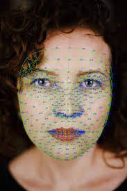
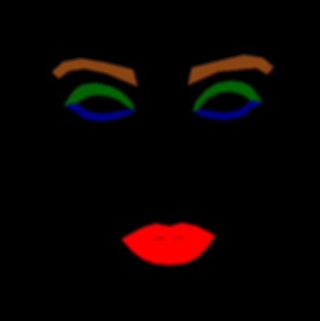
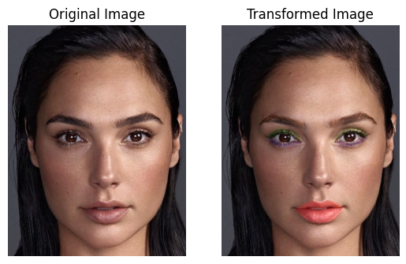

# Virtual Makeup Using Mediapipe
## Clone  and Run
```
git clone https://github.com/Jayanths9/Virtual_Makeup_opencv.git
cd Virtual_Makeup_opencv
conda env create -f environment.yml
conda activate virtual_makeup
```
### Run code on camera
```
python camera.py
```
### Run code on sample image
```
python image.py --image sample/face.png
```

# Introduction

In this project Mediapipe [1] facial landmarks and opencv is used to add makeup on facial features.
- Mediapipe facial landmark library detects the face in the image and returns 478 landmarks on human face. (x,y) coordinates of each points is obtained w.r.t the image size.

<div style="text-align: center;">
  <figure>
    
    <figcaption>Media pipe facial landmarks example [2] </figcaption>
  </figure>
</div>
- From all the facial landmarks extract Lips,Eyebrow, Eyeliner & Eyeshadow points and create a colored mask w.r.to input image.
<div style="text-align: center;">
  <figure>
    
    <figcaption>Colored Mask for Lips, Eyebrow, Eyeliner & Eyeshadow </figcaption>
  </figure>
</div>
- Blend the Original image and the mask w.r.to its weights to add makeup on the original image.
<div style="text-align: center;">
  <figure>
    
    <figcaption>Original image and Transformed Image with Makeup [3]</figcaption>
  </figure>
</div>


# Refrences
1. https://ai.google.dev/edge/mediapipe/solutions/vision/face_landmarker
2. https://medium.com/@hotakoma/mediapipe-landmark-face-hand-pose-sequence-number-list-view-778364d6c414
3. https://i.pinimg.com/originals/a9/93/7d/a9937d95f962f477c486d701a5152752.jpg
