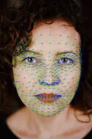
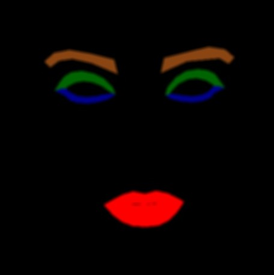
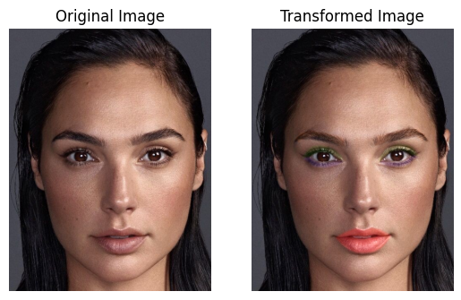
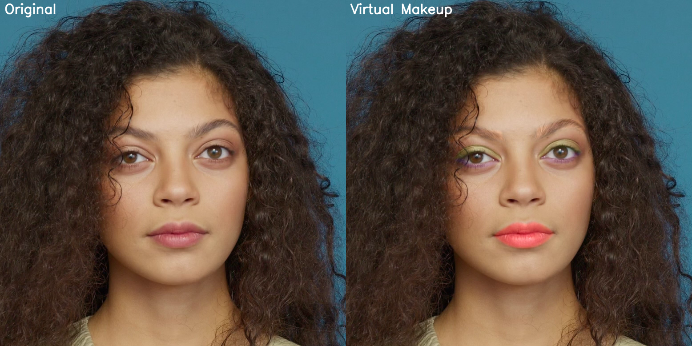

# Virtual Makeup Using Mediapipe

Adds virtual makeup (lips, eyeshadow, eyeliner and eyebrows) to a face in an image or a live webcam feed, using [MediaPipe](https://ai.google.dev/edge/mediapipe/solutions/vision/face_landmarker) face landmarks and OpenCV. Comes with a desktop app to pick colours and presets live, and two small command line scripts.

## Setup

Requires Python 3.11 and [conda](https://docs.conda.io/). Works on Windows, macOS and Linux.

```
git clone https://github.com/Jayanths9/Virtual_Makeup.git
cd Virtual_Makeup
conda env create -f environment.yml
conda activate virtual_makeup
```

Without conda, install the dependencies with pip instead:

```
pip install mediapipe==0.10.14 opencv-contrib-python==4.9.0.80 numpy==1.26.4 pyside6==6.11.2
```

## Desktop app

```
python app.py                          # webcam
python app.py --image sample/face.png  # start on an image
```

- **Source** - switch between webcams or open an image. **Quality** picks the webcam mode: *Auto* takes the largest mode that runs smoothly, up to 1080p (measured once, then remembered in `~/.virtual_makeup/cameras.json`); *480p / 720p / 1080p* force a mode; *Max* takes the biggest size the camera has even if it is slow.
- **Test webcam** - measures every mode of the camera, native and MJPG, and shows a table of what it really delivers (size, format, frame rate). Takes about 40 s. The recommended row becomes the *Auto* choice; select any other row and press *Use selected* to override it.
- **Preset** - pick a look from `presets.json`, then tweak it: every feature has an on/off switch, a colour swatch (click to pick a colour) and an intensity slider. *Reset* goes back to the preset values.
- **Background** - blur everything except the person, with a strength slider.
- **Compare before / after** - split view with the original on the left.
- **Save snapshot** - writes the current frame to a PNG or JPEG.

Keys: `B` blur, `C` compare, `Ctrl+O` open image, `Ctrl+S` snapshot, `Q` quit.

## Command line

### On an image
```
python image.py --image sample/face.png
python image.py --image sample/face.png --preset "Classic red" --blur-background
```
Opens a window with the result, press any key to close it. If no face is detected, the original image is shown.

### On the webcam
```
python camera.py
python camera.py --preset Evening --blur-background --resolution 720p
```
In the video window: `q` quits, `b` toggles the background blur, `1`..`5` switch preset.
`--resolution` is `auto` (default, see Quality above), `detect` (measure again), `max`, or `480p` / `720p` / `1080p` / `1440p` / `4k`.
`python camera.py --test` measures every webcam mode and prints the table, like the Test webcam button in the app.

## Presets

Looks live in `presets.json` and can be edited or extended without touching code. Colours are RGB hex, `alpha` is the intensity from 0 to 1:

```
"Classic red": {
  "lips":      {"color": "#c8102e", "alpha": 0.60},
  "eyeshadow": {"color": "#6e5a4e", "alpha": 0.20},
  "eyeliner":  {"color": "#1a1a1a", "alpha": 0.75},
  "eyebrows":  {"color": "#3d2b1f", "alpha": 0.30}
}
```

Makeup is blended in LAB colour space: the colour channels move toward the chosen shade while the lightness keeps the skin texture and highlights, so a shade looks the same on any skin tone.

## Project structure

| File | Purpose |
|---|---|
| `utils.py` | The engine: landmark indices for each feature, LAB makeup blending, background blur, preset loading |
| `app.py` | PySide6 desktop app |
| `image.py` | Command line: makeup on a single image |
| `camera.py` | Command line: makeup on the webcam |
| `presets.json` | Makeup presets |
| `environment.yml` | Conda environment with pinned dependencies |
| `sample/` | Sample input image and the result images shown below |

The original OpenCV-only version (fixed colours, no app) lives on the [`legacy-opencv`](https://github.com/Jayanths9/Virtual_Makeup/tree/legacy-opencv) branch.

## Introduction

In this project Mediapipe [1] facial landmarks and opencv is used to add makeup on facial features.
- Mediapipe facial landmark library detects the face in the image and returns 478 landmarks on human face. (x,y) coordinates of each points is obtained w.r.t the image size.

<p align="center">
  
  <br>
  <b>Media pipe facial landmarks example [2]</b>
</p>

- From all the facial landmarks, extract Lips, Eyebrow, Eyeliner & Eyeshadow points and create a colored mask with respect to the input image.

<p align="center">
  
  <br>
  <b>Colored Mask for Lips, Eyebrow, Eyeliner & Eyeshadow</b>
</p>

- Blend the Original image and the mask with respect to its weights to add makeup on the original image.

<p align="center">
  
  <br>
  <b>Original image and Transformed Image with Makeup [3]</b>
</p>

- Virtual Makeup on video.
  
<p align="center">
  <a href="sample/output_video.mp4">
    
      <br>
    <b>Virtual makeup on video [4]</b>
  </a>
  
</p>

## References
1. https://ai.google.dev/edge/mediapipe/solutions/vision/face_landmarker
2. https://medium.com/@hotakoma/mediapipe-landmark-face-hand-pose-sequence-number-list-view-778364d6c414
3. https://i.pinimg.com/originals/a9/93/7d/a9937d95f962f477c486d701a5152752.jpg
4. https://www.pexels.com/video/attractive-woman-looking-at-the-camera-7048981/

---
Author:
Jayanth S
universitat Bremen, Bremen
